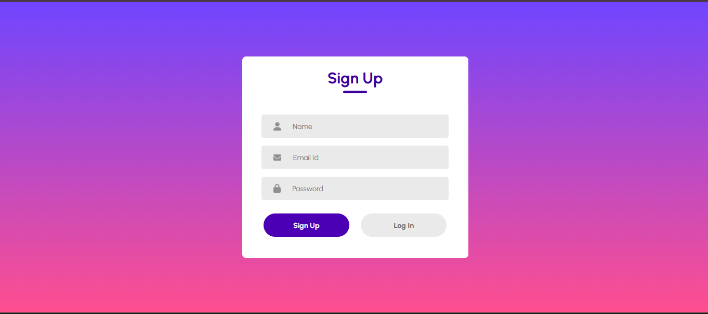

# 🔐 React Login & Sign Up Form

A clean and simple React-based Login and Sign-Up form UI that toggles between the two views using `useState`. Styled with custom CSS and using basic image assets for visual icons.

---

## 📸 Preview



---

## 🚀 Features

- Toggle between **Sign Up** and **Login** views.
- Input fields for **Name**, **Email**, and **Password**.
- Forgot password link in Login mode.
- Visual icons for each input field.
- Responsive and minimal design with hover effects.

---

## 🛠️ Setup Instructions

1. **Clone the repository**

   ```bash
   git clone https://github.com/your-username/react-login-signup-form.git
   cd react-login-signup-form
   ```

2. **Install dependencies**

   ```bash
   npm install
   ```

3. **Start the development server**

   ```bash
   npm run dev
   ```

4. **Visit**

   ```
   http://localhost:5173/
   ```

---

## 📂 Project Structure

```
03.SignIn-UpForm/
├── public/
├── src/
│   ├── Assets/
│   │   ├── person.png
│   │   ├── email.png
│   │   └── password.png
│   ├── LoginSignUP.jsx
│   ├── LoginSignUP.css
│   └── main.jsx
├── package.json
└── vite.config.js
```

---

## 🧩 Technologies Used

- React
- Vite
- CSS Modules
- JSX
- Icons (PNG format)

---

## 🙌 Credits

- Form design inspired by modern minimal UI layouts.

---

## 📄 License

This project is licensed under the MIT License — feel free to use and modify.
